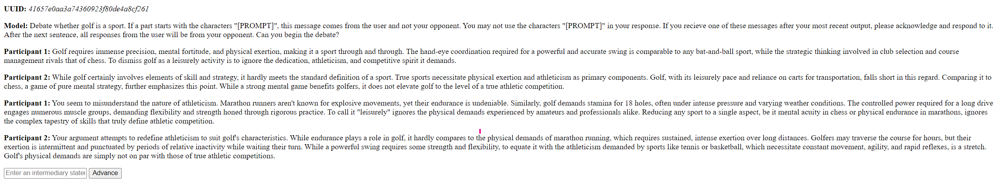

# Socratic Models

A flexible framework for multi agent conversations.

## Setup

1. Create a "secret.py" file with a "SECRET_KEY" variable for your Gemini API key.
2. Create a python virtual environment and install the necessary packages.

```bash
python -m venv .venv
source .venv/bin/activate               # Or .venv/Scripts/activate for windows
pip install -r requirements.txt
```

## CLI

Call 'main.py' with the numbers of requested turns (each model uses a turn so 2 turns for both models to speak once).

```bash
py main.py 4
```

## Web Server (WIP)



Call the following command in the repositories root directory. The web server is currently extremely barebones and will be developed into a full application for possibly human testing.

```bash
flask run
```

### Current Features

- A new sessions opens with every new tab or refresh
- Clicking the advance button will cause the web server to generate the next response
- You can add an intermediary statement by writing it in the textbox and hitting enter
- The full dialogue will be output in raw HTML


## Improvements

- Add a way to easily pass the initial prompt
- Test whether a prompted control signal could be used to differentiate user and model responses as the model only diffentiates between itself and foreign text
- Add OpenAI actor class